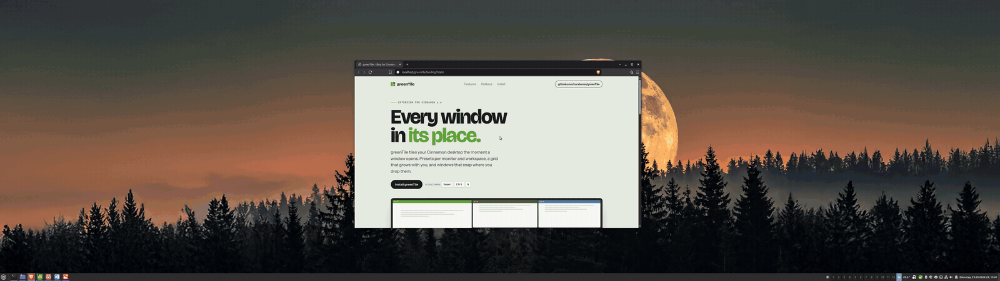
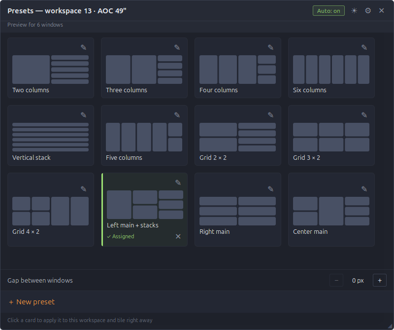
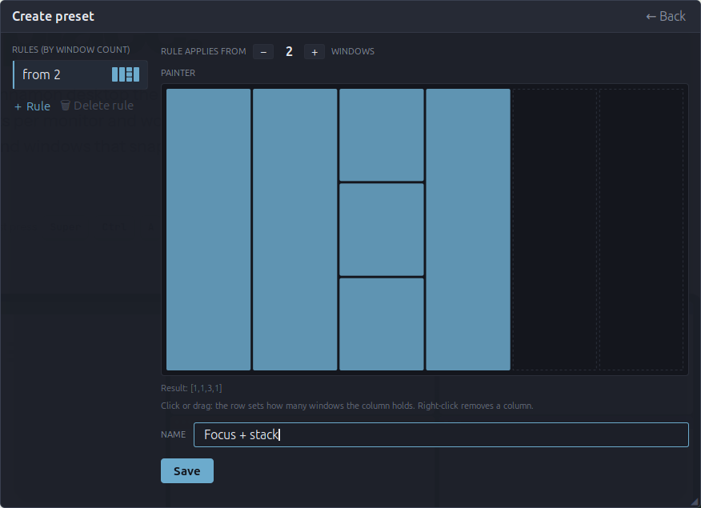

#  greenTile

Window tiling for Cinnamon: presets per monitor and workspace, an auto mode, snap-on-release, draggable borders and keyboard swapping. This README explains how to use it; the complete list of features, each with a short explanation, is in [FEATURES.md](FEATURES.md).

[](https://youtu.be/niI0LHYb1A8)



- **UUID:** `greenTile@carsteneu`
- **Requires:** Cinnamon 6.6; tested on Linux Mint with X11. Newer Cinnamon versions and Wayland are not yet fully verified.
- **Website:** [carsteneu.github.io/greenTile](https://carsteneu.github.io/greenTile/)
- **Video tour (6 min):** [YouTube](https://youtu.be/niI0LHYb1A8)
- **All features at a glance:** [FEATURES.md](FEATURES.md)

## Installation

1. Download `greenTile-<version>.zip` from [Releases](https://github.com/carsteneu/greenTile/releases) and unzip it.
2. Run `./install.sh`. It copies the extension to `~/.local/share/cinnamon/extensions/greenTile@carsteneu/` and compiles the translations (needs `msgfmt` from gettext, otherwise the UI stays English; it also needs `flock` from util-linux). Two installs started at once for the same account serialize on a lock — the later one stops with a note instead of interleaving.
3. Restart Cinnamon (`Ctrl+Alt+Esc`, or `Alt+F2` → `r`). For an update this is what activates the replaced files: a running Cinnamon keeps the extension code it loaded at startup. On Wayland that restart does not exist, log out and back in instead.
4. Enable greenTile in System Settings → Extensions.

To update an installed greenTile, run `./update.sh` from the unpacked zip instead: it downloads the latest release from GitHub and installs it (needs `unzip` and `curl` or `wget`). Re-running it does nothing when the newest version is already installed; `--force` reinstalls. An update replaces the installed files, but the running Cinnamon keeps the library code it loaded at startup — enabling the extension again or reloading it re-reads only `extension.js`. Restart Cinnamon (X11) or log out and back in (Wayland) before judging the new version.

**Updating from 1.2.0 or older:** the settings of four hotkeys have new internal names — *Tile all windows into 3 columns*, *Tile all windows into 6 columns* and turning automatic tiling on and off. On the first start Cinnamon resets these four to their defaults (`Super+Ctrl+3`, `Super+Ctrl+6`, `Super+Ctrl+A`, `Super+Ctrl+D`). If you had changed them, set them again on the **Hotkeys** page. All other settings, presets and layouts are kept.

## Hotkeys

| Key | Action |
|---|---|
| `Super+Ctrl+A` | Auto mode on for this monitor and workspace, tile now (again: retile) |
| `Super+Ctrl+D` | Auto mode off for this monitor and workspace (pauses its preset) |
| `Super+Ctrl+P` | Open or close the preset panel |
| `Super+Ctrl+3` / `6` | 3 or 6 columns of equal width |
| `Super+Ctrl+←/→/↑/↓` | Swap the focused window with its neighbour |
| `Super+←/→/↑/↓` | Move the keyboard focus to the neighbouring tiled window (auto mode; native edge tiling elsewhere) |
| `Super+Alt+→/←` | Focused window wider / narrower (tap = 1 px, hold to speed up) |
| `Super+Alt+↓/↑` | Focused window taller / shorter |
| `Super+G` | Let the focused window float; press again to tile it again |

All keys can be changed on the **Hotkeys** page of the settings (Extensions manager, or ⚙ in the preset panel).

## Presets

A preset is a list of rules by window count. Each rule sets the number of columns and how many windows each column stacks. You assign a preset to a monitor and workspace.

**Preset panel** (`Super+Ctrl+P`, works on the monitor of the focused window):

- Click a row to assign the preset and tile right away. The panel stays open, so you can try several presets.
- ✕ in a row removes the assignment, 🔧 opens the editor, **＋ New preset** starts an empty one.
- **Auto: on / off** in the title bar shows and switches auto mode (green = on).
- **Gap between windows** sets the gap between tiled windows (0 to 48 px). Screen edges stay flush.
- **Reset sizes** appears when borders were moved or layouts dragged, and returns to equal sizes.
- The sun/moon button switches between light and dark; ⚙ opens the settings.
- Drag the title bar to move the panel, ◢ to resize it. `Esc`, ✕ or a click outside closes it.

The thumbnail shows what a click would tile right now. No cell ever stays empty: with fewer windows than cells, the highest column gives up a cell (on a tie the right one), with fewer windows than columns, columns drop from the right. With more windows than cells, the rightmost column takes the rest.

### Editor



- **Rules** (left): "from N" means the rule applies from N windows on; the last matching rule wins. **＋ Rule** adds one, **🗑** deletes the selected one.
- **Painter:** 6 columns × 4 rows. Click or drag to set how many windows a column holds (top = 1, bottom = 4). Right-click removes a column.
- **Save** (or `Enter` in the name field) retiles right away if the preset is in use. **← Back** or `Esc` discards the draft.
- **🗑 Delete preset** (solid red, right of Save) removes the preset after a confirmation and clears its workspace assignments. `Enter` in the name field always saves.

## Auto mode

Auto mode is switched per monitor and workspace. It is on by default where a preset is assigned, otherwise off. While it is on:

- New, closed, minimized and restored windows retile the monitor after 300 ms. New windows are appended at the end.
- A window moved by hand snaps into the slot where you drop it. Moving it to another monitor retiles both.
- Movements are animated (250 ms, can be turned off with **Animate tiling**).

Only visible windows of the active workspace are tiled. The order follows their position on screen.

Pausing keeps the preset assigned but stops automatic tiling, snap-on-release and swapping from that monitor and workspace. Turning auto mode on or selecting a preset explicitly resumes tiling. A pause requested before monitor detection finishes is retained until it can be applied. New windows normally join the end of the layout; an explicit successful drop takes precedence over that automatic ordering.

Without a preset, the auto grid depends on the monitor width:

- **2100 px and wider:** up to 6 windows in one row, then evenly spread over full-width rows (7 = 4 + 3, 8 = 4 + 4).
- **Narrower:** up to 3 windows in one row, then 3 columns with stacks (4 = 1·1·2, 5 = 1·2·2, 6 = 2·2·2).

With **Fill the monitor with a single window** on (settings, **Settings** page, off by default), a lone tiled window fills the whole usable area instead of being left untouched — with an assigned preset too, where its rule for one window applies if it has one. Switching it on retiles right away; switching it off just leaves lone windows be.

## Adjusting the layout

**Moving borders.** Drag the edge of a tiled window, or use `Super+Alt+Arrow`. Neighbours follow. greenTile targets a minimum of 120 px per dimension when the available area and gaps allow it. When that is impossible, it distributes the remaining space evenly and reduces oversized gap insets; invalid or unplaceable frames are left untouched. Applications can enforce larger minimum sizes, so their actual windows may not fit the requested cells. Borders are remembered per monitor, workspace and window count, so opening a fourth window uses the 4-window layout and closing it brings the 3-window borders back.

**Splitting by drag.** While moving a window over another tiled window, a preview shows where it will land. The outer 25 % of a cell are drop zones:

| Zone | Columns layout (presets, narrow grid) | Rows layout (wide grid) |
|---|---|---|
| top / bottom | stack above / below it in its column | new row above / below its row |
| left / right | new column left / right of it | insert left / right of it in its row |

The centre keeps the normal snap. `Esc` during the drag cancels. Dropping onto another monitor works too.

**Swapping.** `Super+Ctrl+Arrow` swaps the focused window with its neighbour, all borders stay. Left/Right continue across monitors (the window moves over and is inserted at the edge) and past the outermost monitor to the previous or next workspace. Focus stays on the moved window, so repeated presses walk it along.

**Focus and border.** `Super+Arrow` moves the keyboard focus to the neighbouring tiled window, without touching the layout. Left/Right cross over to the adjacent monitor at the edge, nothing wraps. Outside auto mode, and for windows the tiling does not manage, the key keeps its native edge-tiling behaviour. After each `Super+Arrow` move the newly focused window flashes a thin **focus border** in the state color for three seconds, so you see where the focus went; mouse clicks and `Alt+Tab` do not show it. It can be turned off in the settings (**Border around the focused window**).

Borders and dragged layouts apply only in auto mode, not to `Super+Ctrl+3/6`.

## Excluding windows

- **Never tile list** (settings, **Settings** page): match by window class, title or app id. **Add an installed application** adds an app id row for you, which also covers flatpaks. Excluded windows float freely and do not count for the layout.
- **`Super+G`** lets a single window float until you press it again or close the window. This is not saved.

## Multiple monitors

Presets and auto mode are stored per monitor and workspace. When DisplayConfig provides a hardware identity, greenTile uses vendor, product and serial, with the connector added when the serial is missing or all zeros, to find the saved assignments after replugging or rearranging displays. If hardware detection fails, it uses a separate name-and-size fallback key. Assignments under the hardware key and the fallback key are not automatically joined. After a monitor change, greenTile waits until the windows have settled and then retiles once.

With `workspaces-only-on-primary` on, secondary monitors share one layout across all workspaces.

Known limitation: layouts are keyed by workspace number and shift when a workspace is removed.

An external layout reset or import cancels older pending resize writes when Cinnamon delivers a changed value. Identical-value imports and the short interval before an external file change is delivered are not fully protected; avoid resetting or importing layouts while a resize is still pending.

## Appearance

On the **Settings** page under **Preset panel**:

- **Panel theme:** follow the desktop (default), always light, or always dark.
- **Accent color:** follow the Cinnamon theme (default) or a custom color.
- **State color** for "Auto: on" and assigned rows: green (default), follow the theme, or custom.

Looking for a specific feature? [FEATURES.md](FEATURES.md) lists all of them.

## Development

Build and install from a checkout using the same validated package as a release. The installer stages the extension and translations before replacing the existing installation, and serializes cooperating installs for the same account on one lock. These commands install files; they do not activate changed library code in a running Cinnamon:

```bash
npm ci
npm run check
./build-release.sh
version=$(node -p "require('./metadata.json').version")
"./dist/greenTile-$version/install.sh"
# Then restart Cinnamon on X11: Alt+F2, type r, press Enter.
# Under Wayland, log out and back in instead.
```

extension.js is the single entry and imports the modules from `lib/` — always
deploy `lib/` alongside it. Copying `extension.js` alone fails with an import
error when `lib/` was never deployed; when an older `lib/` is still on disk the
entry loads instead and silently runs that old library code.

- **Tests:** `npm test` (or `node --test tests/*/*.test.js`) — every test file exactly once, on Node 18 or newer. Test files live one level below `tests/` (`tests/<area>/<name>.test.js`); `node --test tests/` would only work on Node 18/20.
- **Tooling:** `npm ci` once, then `npm run check` — tests, typecheck, lint and a catalog check in one run (the catalog check compiles every `po/*.po` with `msgfmt`, so it needs gettext like the installer; CI installs it). Types are JSDoc checked with `tsc --checkJs` (`npm run typecheck`); there are no TypeScript sources and no build step, everything ships as plain JavaScript.
- **CI:** `.github/workflows/ci.yml` runs `npm run check` on Node 18 and 22 for every push and pull request, and builds the release zip to check that it holds the runtime files only.
- **Release guard:** `tests/architecture/shipped-files.test.js` freezes the zip surface: dev-only material (npm configs, types, tests, research, CI) must never reach `build-release.sh` or `lib/`.
- **Releases:** pushing a `v*` tag runs the checks, verifies that the tag matches the version in `metadata.json`, builds the zip and attaches it to the release (`.github/workflows/release.yml`).
- **Diagnostics:** `~/.xsession-errors` shows `JS ERROR` lines and `greenTile skipped …` lines explaining why a window was not tiled.
- **Translations:** the domain is `greenTile@carsteneu`, template `po/greenTile@carsteneu.pot`. After changing strings, run `./makepot.sh` (needs gettext and cinnamon-xlet-makepot; the script scans a staging copy of the shipped files only, never tests or dev tooling — point `MAKEPOT_PYTHON` at an interpreter with `polib`/`pytz` if they are not installed system-wide). New or changed `.mo` files only take effect after a Cinnamon restart.

### Architecture

Plain JavaScript modules, loaded through the native GJS importer, in five layers. A module may only import modules of its own or a lower layer, and the dependency graph is strictly acyclic:

| Layer | Concern |
|---|---|
| `lib/model/` | pure logic without any Cinnamon access: layouts, splits, presets and rules, drop zones, swap steps, colors, settings keys. Runs in plain Node. |
| `lib/tiling/` | tiling services on top of Cinnamon: work area, collecting windows, placing and animating, reading order, retiling, swapping, focus navigation |
| `lib/runtime/` | components owned by one App, each with its own signals, timers and `destroy()` (auto tiling observer, focus border, drop preview, splits, theme and accent, hotkeys, monitors, exclusions, panel state), plus the session that lives from `enable()` to `disable()` |
| `lib/ui/` | preset panel, editor, Cairo drawing, gettext binding |
| `lib/app/` | composition root: `App` builds the components, `Config` binds the settings and the hotkeys |

`extension.js` starts the session in `enable()` and destroys it in `disable()`; a monitor change replaces the App inside the session. Library modules resolve their dependencies via `imports.extensions['greenTile@carsteneu'].lib.…`, and top-level `var`/function declarations expose their public API. On Cinnamon 6.6 the entry still uses Cinnamon's legacy wrapper, while `lib/` already uses native imports. This loading boundary has also been checked against pinned upstream source, not a complete Cinnamon 6.8 runtime. Native library modules stay cached until Cinnamon restarts. The guards in `tests/architecture/` enforce the layer table, the acyclic graph, no mutable module-level state apart from the entry's private lifecycle holder, model purity, the settings key list and the shipped file list. Generated declarations in `types/xlet/` keep cross-module JSDoc types checked without adding runtime build output. `tests/` is organised like `lib/` (`model/`, `tiling/`, `runtime/`, `app/`) plus `architecture/`, `i18n/` and `helpers/`.

## Origin

greenTile is a fork of **gTile** 2.2.1 (`gTile@shuairan`):

- originally written by **vibou** for GNOME Shell: [vibou/vibou.gTile](https://github.com/vibou/vibou.gTile)
- ported to Cinnamon by **shuairan**: [shuairan/gTile](https://github.com/shuairan/gTile)
- maintained in the Linux Mint Spices repository: [cinnamon-spices-extensions/gTile@shuairan](https://github.com/linuxmint/cinnamon-spices-extensions/tree/master/gTile%40shuairan)

The starting point was gTile's shipped bundle `5.4/gTile.js`. The extension skeleton and the translation sources (`po/`) come from gTile; the classic grid was removed, everything else described above was added in greenTile. If gTile is still installed, disable it, since both claim the same keys.

## License

[GNU General Public License, version 3](https://www.gnu.org/licenses/gpl-3.0.html), like gTile. See `LICENSE`.

- Original code: vibou, shuairan and the gTile contributors
- Modifications and additions: © 2026 carsten_eu
